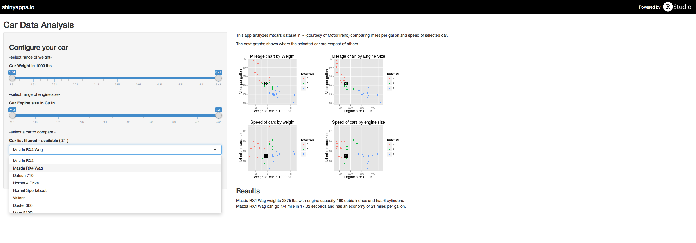

Car Data Analysis
========================================================
author: Roberto Baladrón Pardo
date: 25/04/2015

========================================================
The application lets you select a car filtered with Weight restrictions and Engine Capacity
Result shows how the car you selected stands in comparison with other cars with same criteria

Data
========================================================
This application does anlaysis of mtcars dataset in R (courtesy Motor Trend).


```r
head(mtcars)
```

```
                   mpg cyl disp  hp drat    wt  qsec vs am gear carb
Mazda RX4         21.0   6  160 110 3.90 2.620 16.46  0  1    4    4
Mazda RX4 Wag     21.0   6  160 110 3.90 2.875 17.02  0  1    4    4
Datsun 710        22.8   4  108  93 3.85 2.320 18.61  1  1    4    1
Hornet 4 Drive    21.4   6  258 110 3.08 3.215 19.44  1  0    3    1
Hornet Sportabout 18.7   8  360 175 3.15 3.440 17.02  0  0    3    2
Valiant           18.1   6  225 105 2.76 3.460 20.22  1  0    3    1
```

Using the App
========================================================

Specifiy the following using slider bars & dropdown box:
1: Slide to restrict the maximum weight in units of 1000lbs
2: Slide to restrict the maximum engine capacity in cubic inches
3: List of cars that satisfy the filtering criteria from Input 1 & 2

About
========================================================

This applet was made as a project for Coursera's MOOC Developing Data Products

It was written in R and hosted by shiny apps at https://rbaladron.shinyapps.io/Cars
